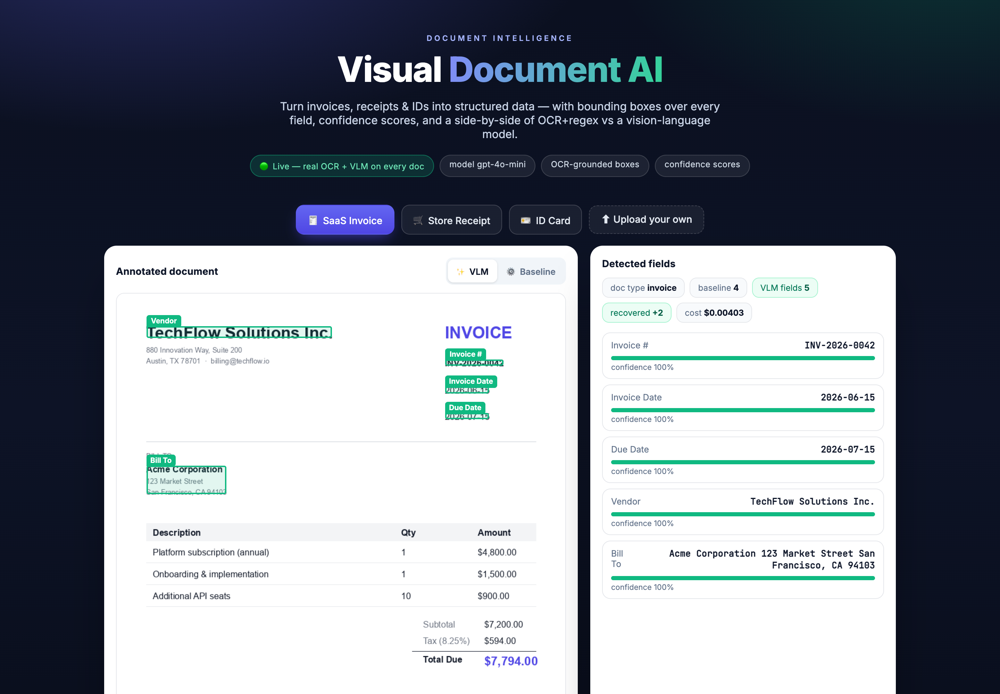
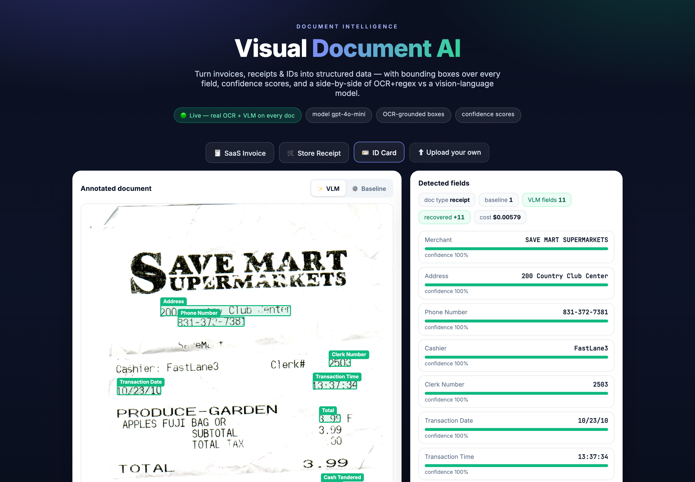
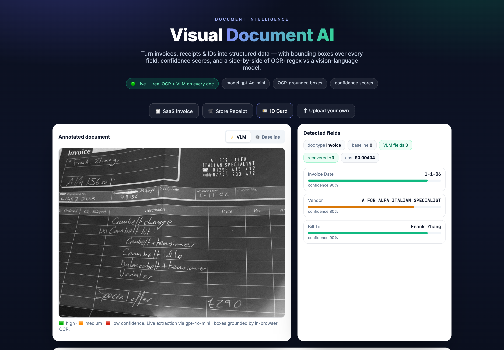
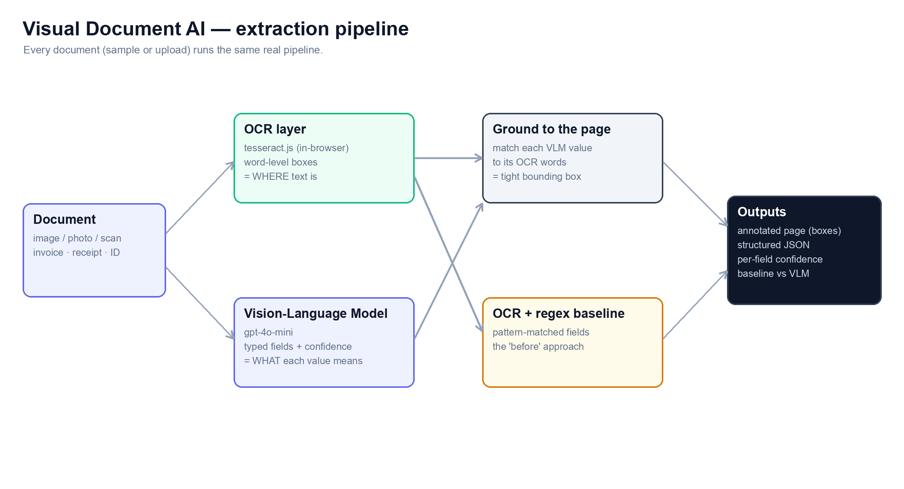

# 📄 Visual Document AI — web (Next.js + Vercel)

Upload an **invoice, receipt, or ID** and get back the page with **bounding
boxes over every detected field**, **structured JSON with confidence**, and a
**baseline-vs-VLM** comparison. This is the Vercel-deployable web version of the
[Python/Gradio project](../visual-doc-ai).

**Live demo → https://visual-doc-ai-web.vercel.app**



### Works on real-world documents, not just the samples

Upload any document and it runs the same live pipeline. A real photographed
store receipt — 11 fields extracted, boxes grounded by OCR:



Even a **handwritten** invoice photo — the VLM reads the vendor, customer and
date (with honest, varied confidence); OCR can't ground handwriting so boxes
are sparse there, and the UI says so:



## How it works



**Every document — bundled sample or your own upload — runs the same real
pipeline** in a serverless route (`app/api/extract/route.ts`). There is no
canned "demo" branch:

1. **OCR** the page with `tesseract.js` (pure WASM, runs in the function) →
   word-level boxes. This is where the bounding boxes come from.
2. **VLM**: `gpt-4o-mini` reads the image → typed fields + confidence. This is
   where meaning comes from.
3. Each VLM value is **located back to OCR words** for a tight box; boxes are
   normalized and drawn as overlays scaled to the image.
4. The **OCR+regex baseline** runs on the same OCR text, and the UI diffs it
   against the VLM field-for-field — an honest, live comparison.

Sample clicks are cached per session so you don't re-spend on the same doc.

> Offline fallback: with **no key on the server**, the bundled samples fall back
> to baked ground truth (`public/samples/*.json`) so the repo still demos
> without an API key. The deployed site runs the full real pipeline.

## Run locally

```bash
npm install
cp .env.example .env.local      # add OPENAI_API_KEY to enable uploads (optional)
npm run dev                     # http://localhost:3000
```

Without a key the bundled samples still work; uploads are disabled with a note.

## Deploy to Vercel

```bash
vercel            # link + preview
vercel --prod     # production
```

Then set `OPENAI_API_KEY` (and optionally `OPENAI_MODEL`) in
**Project → Settings → Environment Variables** to enable live uploads. Never
commit the key — it lives only in Vercel's encrypted env.

## What it demonstrates

Vision-language extraction · structured output (typed JSON + confidence) ·
bounding-box overlays · a measured baseline-vs-VLM case study · a Next.js app
with a serverless OpenAI route, deployable in one command.
